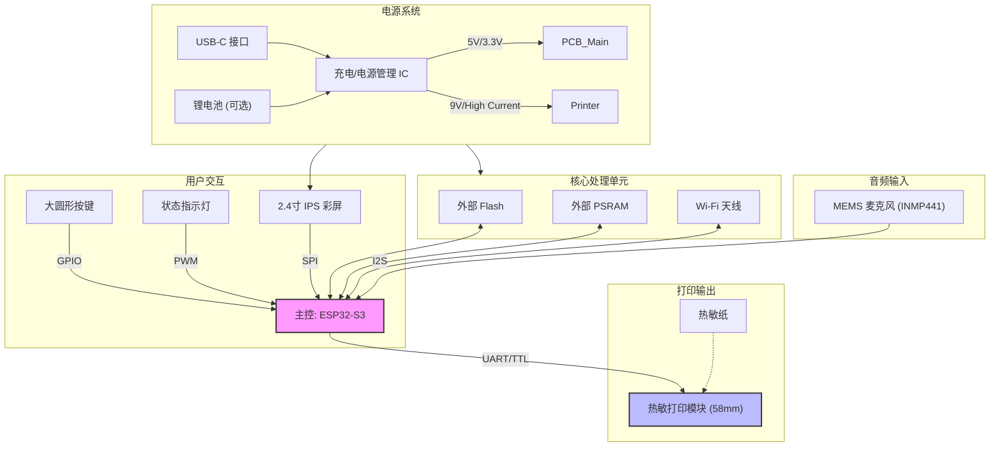
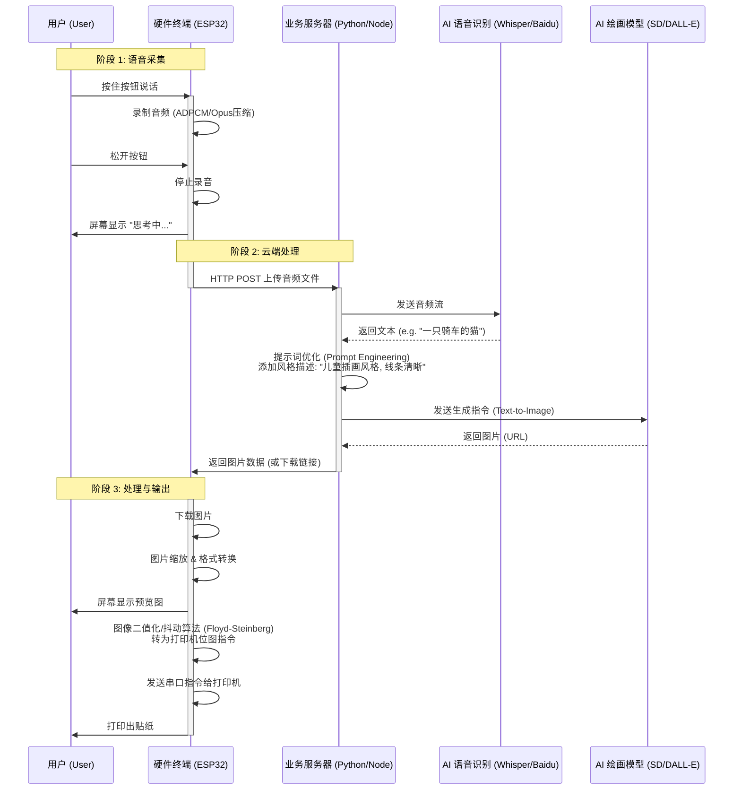

这是一个非常有趣的创意产品。根据链接内容，该产品名为 **Stickerbox**，是一款面向儿童的 **AI 贴纸打印机**。它通过语音交互生成图像，并利用热敏打印技术将图像即时打印成黑白贴纸。

如果要在使用中国市场的供应链复刻（DIY）一个类似的产品，我们需要将其拆解为 **硬件端（端侧）** 和 **云端（AI服务）** 两部分。由于本地运行文生图大模型对硬件算力要求极高（需要昂贵的NPU/GPU），这类产品通常采用 **“端+云”** 架构：硬件负责采集语音、联网和打印，云端负责复杂的AI运算。

以下是具体的复刻方案、硬件清单、架构设计及系统流程。

---

### 一、 产品分析与复刻思路

**核心功能：**

1. **语音输入**：按下按钮说话。
2. **联网处理**：将语音发送至云端，识别为文本（STT），再生成图片（AIGC）。
3. **屏幕反馈**：显示生成的图片预览。
4. **实体输出**：通过热敏打印机打印贴纸。

**复刻技术路线（低成本方案）：**

* **主控**：ESP32-S3（自带Wi-Fi/蓝牙，支持AI指令集，足够驱动屏幕和处理简单音频，生态丰富）。
* **打印模块**：58mm 嵌入式热敏打印头（串口通讯，淘宝非常多）。
* **AI后端**：通过API调用国内大模型（如百度文心一格、阿里通义万相）或搭建Stable Diffusion接口。

---

### 二、 硬件选型（中国市场采购指南）

如果在中国市场（淘宝/1688/华强北）采购零件，推荐以下配置：

| 模块名称 | 推荐型号/规格 | 市场参考价 (RMB) | 备注 |
| --- | --- | --- | --- |
| **主控开发板** | **ESP32-S3** (N16R8) | ¥25 - ¥35 | 必须选带PSRAM版本，用于缓存图片数据。推荐合宙、安信可等品牌。 |
| **热敏打印模块** | **58mm 嵌入式热敏打印头** (TTL电平) | ¥35 - ¥60 | 搜索关键词“58mm热敏打印模块 TTL串口”。需要确认支持位图打印指令。 |
| **屏幕** | **2.0寸/2.4寸 IPS 串口屏** (ST7789驱动) | ¥15 - ¥25 | SPI接口，分辨率320x240或240x240，用于显示生成的图像。 |
| **麦克风** | **INMP441** 或 **MSM261S4030H0** | ¥5 - ¥10 | I2S接口全向麦克风，比模拟麦克风抗干扰能力强，适合语音识别。 |
| **按键** | **带灯巨型圆顶按钮** (100mm) | ¥10 - ¥20 | 街机游戏机按钮，还原原产品的“拍打”体验。 |
| **电源管理** | **TP4056 充电模块** + 升压模块 | ¥5 | 如果需要电池供电；打印机通常需要5V-9V大电流，需注意升压板功率（至少2A）。 |
| **外壳** | 3D打印 (PLA/ABS) 或 激光切割亚克力 | ¥50+ | 模仿红色方盒子设计。 |

---

### 三、 具体的架构设计

#### 1. 硬件架构

系统以 **ESP32-S3** 为核心。它通过 I2S 读取麦克风数据，通过 SPI 驱动屏幕，通过 UART (串口) 发送指令给打印机。Wi-Fi 模组集成在主控中，负责与云服务器通信。

#### 2. 软件架构

软件分为 **嵌入式固件 (Firmware)** 和 **云端服务 (Cloud Backend)**。

* **固件 (C++/MicroPython)**: 负责硬件驱动、录音压缩、HTTPS请求、图片解码与抖动算法（将彩色图转为黑白点阵）。
* **云端 (Python/Node.js)**: 充当中转站。接收音频 -> 调用 STT (语音转文字) -> 调用 LLM (优化提示词，这是关键，为了让儿童的简单语言生成更好的画) -> 调用 TTI (文生图) -> 返回图片 URL。

---

### 四、 架构图与系统流图

以下是符合 mermaid 8.8.0 格式的图表。

#### 1. 硬件架构图 (Hardware Architecture)

#### 2. 系统软件流图 (System Data Flow)

这个流程图展示了从用户按下按钮到贴纸打印出来的完整数据链路。

### 五、 关键技术难点提示

1. **图片转打印指令（抖动算法）**：
* 热敏打印机只能打黑和白（没有灰度）。云端生成的图片是彩色的。你需要在一个名为 **Floyd-Steinberg Dithering** 的算法上做文章，将彩色图片转换为由疏密不同的黑点组成的图像，这样打印出来才有层次感。这步建议在 ESP32 上做，或者在服务器端处理好直接下发二值化图片给 ESP32，以减轻单片机压力。

2. **安全过滤**：
* 作为儿童产品，云端必须加一层过滤器。如果识别出“恐怖”、“暴力”等词汇，不应传给绘图AI，而应返回一个预设的错误提示图。

3. **电源干扰**：
* 热敏打印机工作时电流波动很大（瞬间可达2A以上），极易拉低电压导致单片机重启或Wi-Fi断连。务必使用独立的电源稳压电路，或者在打印机电源端并联大电容。